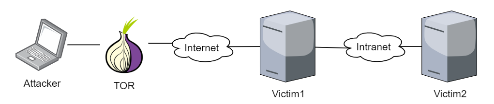

# Overview

In this section we will be showing how to use [**Offensive Tor Toolkit**](https://github.com/atorrescogollo/offensive-tor-toolkit) for pentesting over Tor. This suite of tools will allow us to execute exploitation and post-exploitation tasks from the victim preserving the attacker anonymity.

First of all, we have the following vulnerable scenario:

* **Victim1** serves a vulnerable service to Internet.
* **Victim2** serves a vulnerable service to the internal network and it has no access to Internet.

